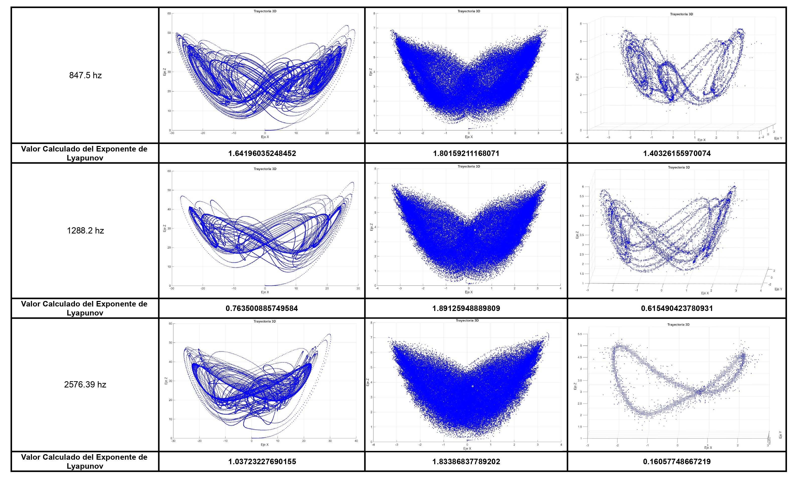
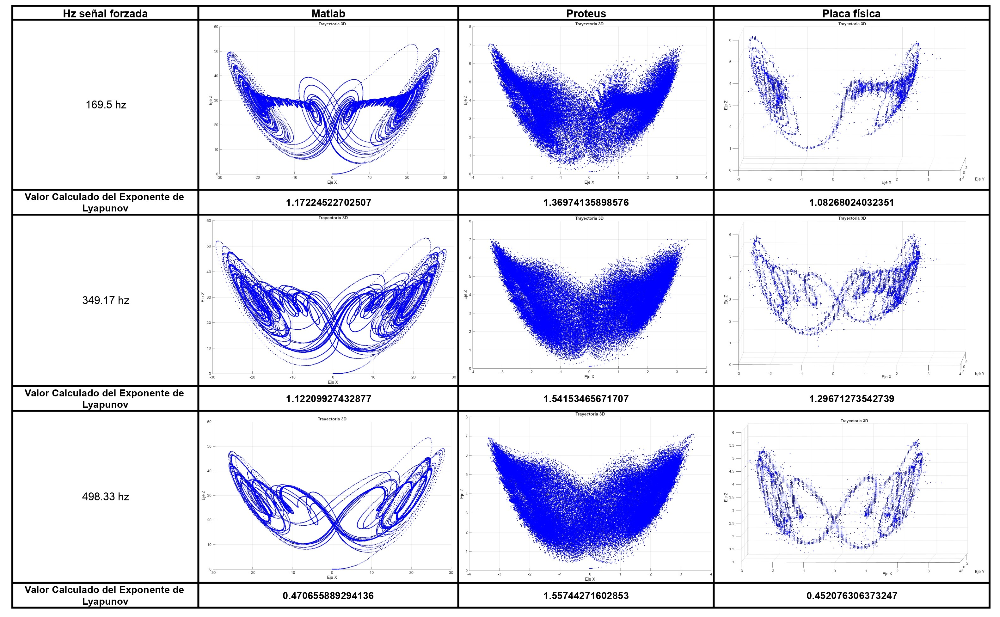

# Supplementary Material: Lyapunov Exponent Validation for Financial Emulator

Este repositorio contiene los recursos visuales en alta resolución, las tablas de datos y el manuscrito completo correspondientes al artículo "Lyapunov Exponent Validation for Financial Emulator".

## 📄 Información del Artículo
* **Título:** Lyapunov Exponent Validation for Financial Emulator
* **Autores:** Alejandro Perez-Hernandez, Hugo G. Venegas, Alejandra Ibarra, Pedro M. Gomez y Alma Y. Alanis.
* **Institución:** Centro Universitario de Ciencias Exactas e Ingenierías (CUCEI), Universidad de Guadalajara, Guadalajara, Jal., México.

---

## 📂 Contenido del Repositorio

De acuerdo con la estructura actual del proyecto, los archivos disponibles son los siguientes:

* **`Lyapunov-Exponent-Validation...pdf`**: Documento completo del artículo.
* **`LorenzCircuitoSec.png`**: Diagrama del esquema electrónico del circuito analógico analizado en el artículo.
* **`ExponentesTabla.pdf`**: Archivo PDF con la recopilación completa de las tablas de datos del artículo.
* **`ExponentesTabla1.jpg`** y **`ExponentesTabla2.jpg`**: Imágenes en alta resolución correspondientes a las comparaciones visuales de los atractores caóticos en los diferentes entornos de prueba (Anexo 1).

---

## 🔎 Visualización de Atractores Extraños (Anexo 1)

A continuación se presenta una vista previa de las señales caóticas generadas ante variaciones de la frecuencia de entrada en MATLAB®, Proteus® y la PCB física:

### Comparación Visual - Frecuencias Bajas y Medias

### Comparación Visual - Frecuencias Altas y Críticas

---

## ✉️ Contacto
Para dudas sobre el contenido del artículo en general, puedes contactar a los autores mediante los correos institucionales indicados en el artículo.
